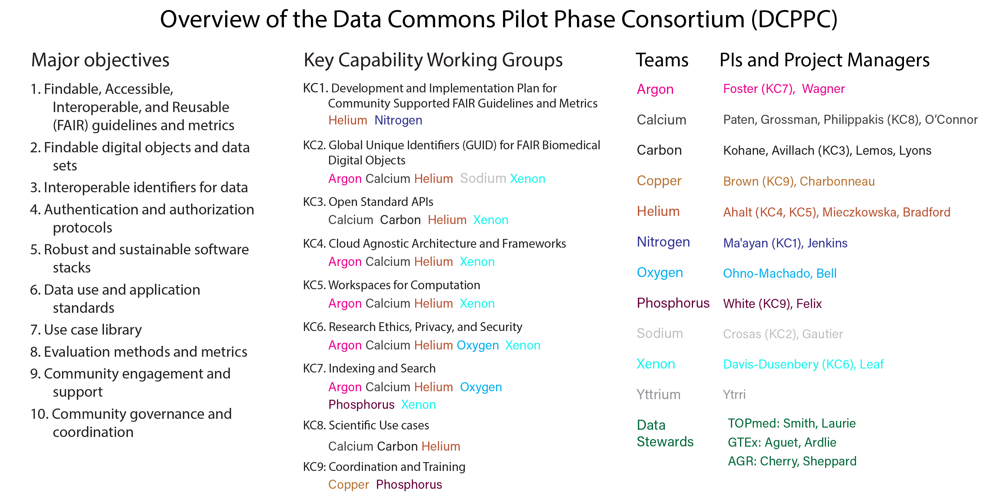
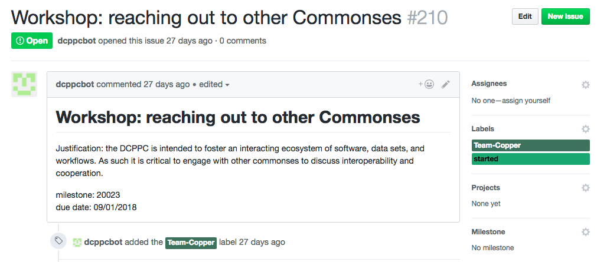

# 

In November 2017, the National Institutes of Health (NIH) [announced][press1] the formation of a Data Commons Pilot Phase Consortium (DCPPC) to accelerate biomedical discovery by making big biomedical data more findable and usable. 

It's called a consortium because the [awardees][awardees] are all working together in concert and collaboration to achieve the larger goal. Those awardees (big cats who run academic research labs or companies) have each brought on numerous students, postdocs, and staff, so the size of the consortium has already grown to over 300 people! That's a lot of [cats to herd][cats].

So, how are we keeping everyone in the community coordinated and engaged? Here's a little insight into our approach, which was first outlined by Titus in [this blog post][approach]. 

## DCPPC Key Capabilities and teams

The overall structure of the DCPPC is a little complex, especially to the uninitiated.  Members of the consortium organized themselves into "Key Capabilities" or focus groups that correspond to elements of the funding call and the major objectives of the Data Commons. Key Capabilities (KC) 1-9 are described in more detail [here](https://hackmd.io/s/HJKUu1WWf).

On top of the KC lingo, each of the awardees all adopted team names from the elements of the periodic table, so you'll hear thing things like "KC1 has a meeting on Wednesday" or "Team Copper is meeting on Tuesday". I made infographic below to help myself see the connections between the DCPPC objections, key capacities and teams. 

I am a member of Team Copper, which consistes of members or affiliates of [the Data Intensive Biology Lab][DIBlab] at UC Davis (C. Titus Brown, Phillip Brooks, Rebecca Calisi Rodriguez, Amanda Charbonneau, Rayna Harris, Luiz Irber, Tamer Mansour, Charles Reid, Daniel Standage and Karen Word), the Biomedical data analysis company [Curoverse][curoverse] (Alexander (Sasha) Wait Zaranek, VM (Vicky) Brasseur, Sarah Edrie, Meredith Gamble and Sarah Wait Zaranek), and the [Harvard Chan Bioinformatics Core][hcbc] (Brad Chapman, Radhika Khetani and Mary Piper).

## GitHub for project management of 522 milestones and 50 deliverables

Very early on, it was decided that [GitHub](https://github.com/) would be our authoritative and canonical source for all DCPPC milestones and deliverables. What are milestones and deliverables? Milestones are team-defined tasks that must be completed in order to achieve the long-term objective of the DCPPC. Deliverables are the currency by which we evaluate whether or not a milestone has been reached. Deliverables can be in either the form of a demo (activities or documentation that demonstrate completion of goals of the Commons) or products (resources such as standards and conventions, APIs, data resources, websites, repositories, documentation, and training or outreach materials). The DCPPC has defined 522 milestones and 50 deliverables that are due in the first 180 days (between April 1 and September 28, 2018). 

Why GitHub? We chose GitHub because it makes cross-project linking and commenting easy and many people are familiar with it. 

How did we get all the information about 500 milestones ingot GitHub issues? **We automated it!** One of the first accomplishments of Team Copper was developed a collection of scripts (collectively referred to as the "DCPPC bot") that takes a CSV file of all the milestones and deliverables and opens GitHub issues with a brief description, a due date, and a label corresponding the relevant Team. 

Right now, the DCPPC bot only deals with DCPPC milestones and deliverables, but you could imagine how this tools could be modified and adapted to many other large-scale community projects. 

## On-boarding existing and new members

To get everyone on the same page, we put in place some loose guidelines for communication (we'll be using this platform for e-mail, that project for documents, etc.). We defined a community code of conduct and have adopted open and transparent workflows to the best of our ability. 

We wrote some simple onboarding documents and checklists to connect people to those guidelines, communication channels, and useful resources. New members fill out a Google form providing basic contact information and their affiliation to the DCPPC. Then Team Copper gives them access to all the various communication channels. Finally, we send a follow-up email pointing new members to all the relevant resources and documentation. We haven't perfected on onboarding process, but this thank you note is evidence that we are on the right track!

_"Thank you so much for this information! I just started with [the DCPPC] 3 weeks ago and the learning curve has been steep. These docs have been the best crash course. Thank you!" - Anonymous DCPPC member_

It is important to note that we are paying attention to what communication avenues are actually being used or working well and are fine-tuning accordingly. For instance, we started using Google Calendars, but it wasn't working, so we switched to the [Groups.io](https://groups.io/) calendar. Our goal is to layer on more structure only when the need becomes apparent (but without doing so too early or often) to preserve flexibility and adaptation to suit the needs of the community.

The best thing (in my opinion) about using Groups.io, GitHub, and Slack for communication is that new members have access to all the conversation that has taken place since the beginning. This provides a wealth of information that would be lost if all communication took place via personal email or face to face communication. 

Another excellent feature of the tools we are using is the availability of [APIs][apiwiki] for automating processes and reconciling access lists. We configured our groups.io calendars to automatically post upcoming meeting notifications to the appropriate Slack channel, so that's cool! We also built a tool that calls the Slack, GitHub, and Groups.io APIs and returns a list of everyone with access. This is really useful for checking to be sure that everyone who needs access has it (or that no one who shouldn't doesn't). 

## Monthly, unconference style meetings and hackathons

Virtual tools like Slack, GitHub, Twitter, and Zoom make synchronous and asynchronous communication possible from nearly anywhere in the world, but the power of face to face (f2f) communication is undeniable a powerful way to boost collaboration and creativity. As a testament to the Consortium’s commitment to community engagement, a significant part of our budget is being used to cover all the associated travel, lodging, and food costs.  

Team Copper (see the list of members below) has taken on the role of organizing or facilitating these f2f meeting. We are adopting an ["unconference style"][unconferencewiki] format where the attendees determine the topics of discussion or direction of a [hackathon][hackathonwiki].

The goal of the first f2f meetings in December 2017 was to determine what the DCPPC actually needed to do during the first 180 days of this effort (aka Pilot Phase I). This meeting was attended by NIH staff, awardees, cloud service providers, and data stewards. You can read more about the outcomes of this meeting in [a blog post][kickoff] written by C. Titus Brown. The second f2f meeting took place on April 2018. The goal of the April meeting the goal was to showcase our progress to the NIH.

Moving forward, we are planning a f2f meeting every month at various sites around the US. 
The goals of the DCPPC May workshop are to build community, to facilitate planned and serendipitous collaboration across teams, and to surface hidden issues around technical and conceptual interoperability. A major focus of the June meeting will be a multi-team, multi-KC hackathon. The goals and topics for our meetings in July - October meetings have yet to be determined but will likely correspond to relevant milestones and deliverable that are due those months or the near future.

## Want more updates?

There's a lot that I didn't cover, so stay tuned for more in-depth blog posts about building an open-source style community around the Data Commons. In the mean time, get regular updates by following the [#CommonsPilot][hashtag] hashtag or the [@nih_dcppc](https://twitter.com/nih_dcppc) ‏and [@NIH_CommonFund](https://twitter.com/NIH_CommonFund) accounts on Twitter. 

[press1]: https://www.nih.gov/news-events/news-releases/nih-awards-test-ways-store-access-share-compute-biomedical-data-cloud
[awardees]: https://commonfund.nih.gov/commons/awardees 
[cats]: https://www.youtube.com/watch?v=Pk7yqlTMvp8
[approach]: http://ivory.idyll.org/blog/2018-growing-community.html
[unconferencewiki]: https://en.wikipedia.org/wiki/Unconference
[kickoff]: http://ivory.idyll.org/blog/2017-commonspilot-kickoff.html
[hackathonwiki]: https://en.wikipedia.org/wiki/Hackathon
[apiwiki]: https://en.wikipedia.org/wiki/Application_programming_interface
[DIBlab]: http://ivory.idyll.org/lab/
[curoverse]: https://curoverse.com/
[hcbc]: http://bioinformatics.sph.harvard.edu/
[hashtag]: https://twitter.com/search?src=typd&q=%23commonspilot
